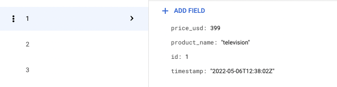

# CSV to Firestore

The CSV to Firestore solution takes a CSV file from a Cloud Storage bucket, parses it and sends it to Firestore. The solution is automatically triggered when a new file is uploaded in the Cloud Storage bucket. In order to serve a variety of applications, the solution allows you to (1) select which cloud bucket to use, (2) specify to which collection to send the data and (3) if you want to use a specific column as document id.

## Parsing Example

CSV file with id as document id:

```
id, product_name, price_usd
1,television,399
2,water bottle,15
3,glass mug,5
```

Data in Firestore:



## Deployment

The cloud function requires the collection id the be specified in the filename
as the following: "filename[collection=YOUR_COLLECTION_ID].csv" Optionally it is
also possible to add [key=YOUR_COLUMN_FOR_DOCUMENT_ID] to the filename to
specify which column to use for the document id. If no column is specified,
firestore will create a random id.

Retrieve the repository by running the following command:

``` git clone https://github.com/Google/csv-to-firestore ```

Complete and run the following command to deploy the cloud function.

```console
gcloud functions deploy cs_to_firestore \
  --runtime python39 \
  --trigger-resource YOUR_TRIGGER_BUCKET_NAME \
  --trigger-event google.storage.object.finalize \
  --entry-point cs_to_firestore_trigger \
  --source PATH_TO_SOURCE_CODE \
  --memory=1024MB \
  --set-env-vars=UPLOAD_HISTORY=TRUE/FALSE,EXCLUDE_DOCUMENT_ID_VALUE=TRUE/FALSE \
  --timeout=540
```

Complete the following parameters in the command:
1. YOUR_TRIGGER_BUCKET_NAME: The path of the cloud storage bucket that triggers the cloud function.
2. PATH_TO_SOURCE_CODE: The path to the folder that contains main.py and requirements.txt ( use . for the current directory )
3. UPLOAD_HISTORY: TRUE or FALSE depending on if you want to create a separate collection that keeps file upload history.
4. EXCLUDE_DOCUMENT_ID_VALUE: TRUE or FALSE. When a document id is specified in the filename the solution stores a value, such as "id" in both the document id and the data in this document. If this is not desired, set this EXCLUDE_DOCUMENT_ID_VALUE to TRUE so that it is only stored as a document id
5. Optionally you can specify the region or other parameters, see documentation here: https://cloud.google.com/sdk/gcloud/reference/functions/deploy

**Note:** After deploying the Cloud Function the logs might display a "OpenBLAS
WARNING". This is the result of some of the used packages and does not influence the functionality of the Cloud Function.

### Deploying BQ Export to Firestore
If you have your data on BigQuery and want to set up an automated workflow to export this table to Firestore you
can follow the following instructions.

1. Install [Terraform](https://www.terraform.io/downloads)
2. Set up the variables for terraform in the `example.tfvars` file. See `variables.tf` for description of each
 variable.
3. Run: `terraform init` from the terraform directory
4. Run: `terraform plan -var-file="example.tfvars"` to see the planned changes
5. Run: `terraform apply -var-file="example.tfvars"` to deploy the Cloud Function and set up the workflow.

#### Guided tutorial for deployment
[](https://shell.cloud.google.com/cloudshell/editor?cloudshell_git_repo=https://github.com/google/csv-to-firestore&cloudshell_image=gcr.io%2Fgraphite-cloud-shell-images%2Fterraform%3Alatest&cloudshell_git_branch=main&cloudshell_open_in_editor=example.tfvars&cloudshell_workspace=terraform%2F&cloudshell_tutorial=tutorial.md&ephemeral=true)

### Disclaimer
This is not an officially supported Google product. Please be aware that bugs may lurk, and that we reserve the right to make small backwards-incompatible changes. Feel free to open bugs or feature requests, or contribute directly (see CONTRIBUTING.md for details).